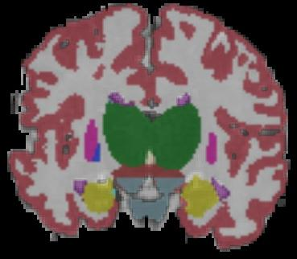
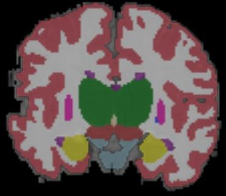
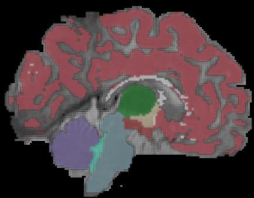
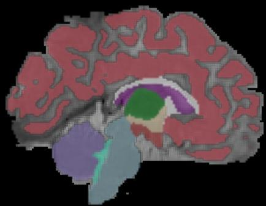
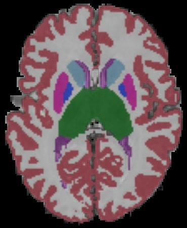
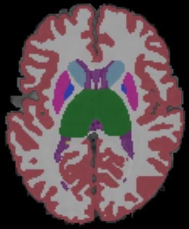

# 00-02mos_Template05

Below are the manual (i.e., ground-truth) segmentations and the segmentations
inferred by the model trained by nnU-Net.

## Images

### Segmentation superimposed on T1 and T2 images

Here we have the images layered (from top to bottom):

1. Segmentation (50% opacity)
2. T1 (50% opacity)
3. T2

I also added smoothing.

Ground-truth coronal       |  Inferred coronal
:-------------------------:|:-------------------------:
  |  

Ground-truth sagittal       |  Inferred sagittal
:-------------------------:|:-------------------------:
  |  

Ground-truth axial       |  Inferred axial
:-------------------------:|:-------------------------:
  |  

