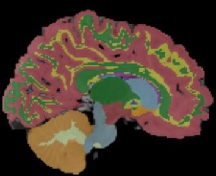

# 8mo_Template09

Below are the manual (i.e., ground-truth) segmentations and the segmentations
inferred by the model trained by nnU-Net.

## Images

### Segmentation superimposed on T1 and T2 images

Here we have the images layered (from top to bottom):

1. Segmentation (50% opacity)
2. T1 (50% opacity)
3. T2

I also added smoothing.

This nnU-Net was trained on 8 training/cross-validation cases of 8-month-old babies.

The T1, T2, and manually segmented (a.k.a. "ground truth") files are here:

    * /home/feczk001/shared/data/nnUNet/segmentations/JLF_templates_testing/wm_JLF_atlases/8mo/Template09/

The nnU-Net inferred segmentation is available here:

    * /home/feczk001/shared/data/nnUNet/segmentations/inferred/Task500_Babies8Mo/8mo_Template09.nii.gz

Ground-truth coronal       |  Inferred coronal
:-------------------------:|:-------------------------:
  |  

Ground-truth sagittal       |  Inferred sagittal
:-------------------------:|:-------------------------:
  |  

Ground-truth axial       |  Inferred axial
:-------------------------:|:-------------------------:
  |  

## Outline

Ground-truth coronal       |  Inferred coronal
:-------------------------:|:-------------------------:
  |  

Ground-truth sagittal       |  Inferred sagittal
:-------------------------:|:-------------------------:
  |  

Ground-truth axial       |  Inferred axial
:-------------------------:|:-------------------------:
  |  
