# Task501_Babies_AllMonths

In this data set, in addition to the T1 and T2 images, we added uniformly colored
grey-scale volumes that coded up the age as a third image for each subject.

I trained this nnU-Net model on 34 training/cross-validation cases of 0- to 8-month-old babies.
The age distribution for the training/cross-validation set was:

| Age (months)      | training set count | 
| ----------- | ----------- |
| 0&#8211;2      | 16        |
| 1  | 2        |
| 2 | 6         |
| 6 | 4         |
| 8 | 6         |

The T1, T2, and manually segmented (a.k.a. "ground truth") files are here:

    * /home/miran045/reine097/JLF_templates_testing/wm_JLF_atlases/

The nnU-Net inferred segmentations are available here:

    * /home/feczk001/shared/data/nnUNet/segmentations/inferred/Task501_Babies_AllMonths/

Below are the manual (i.e., ground-truth) segmentations and the segmentations
inferred by the model trained by nnU-Net.

## Images

### Segmentation superimposed on T1 and T2 images

Here we have the images layered (from top to bottom):

1. Segmentation (100% opacity)
2. T1 (50% opacity)
3. T2

I also added smoothing.

Ground-truth sagittal       |  Inferred sagittal
:-------------------------:|:-------------------------:
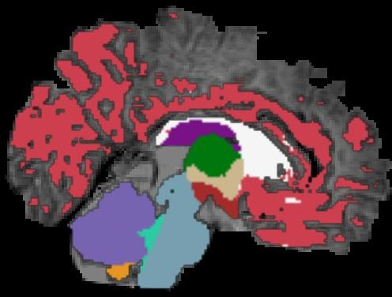  |  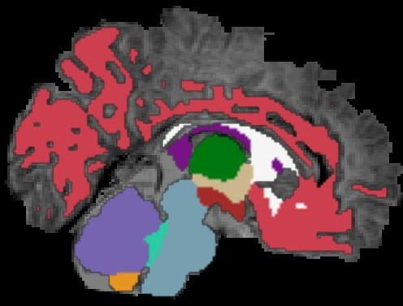
  |  

Ground-truth coronal       |  Inferred coronal
:-------------------------:|:-------------------------:
  |  
  |  

Ground-truth axial       |  Inferred axial
:-------------------------:|:-------------------------:
 |  
  |  

Dice coefficient: 0.9144429929377774

## 2mo_Template06

Ground-truth sagittal       |  Inferred sagittal
:-------------------------:|:-------------------------:
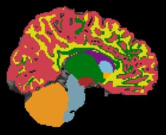  |  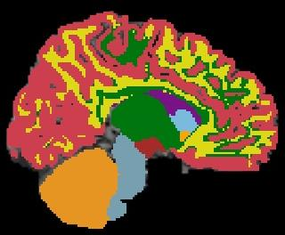
  |  

Ground-truth coronal       |  Inferred coronal
:-------------------------:|:-------------------------:
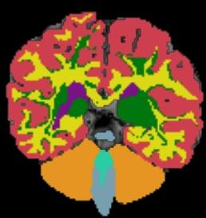  |  
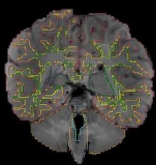  |  

Ground-truth axial       |  Inferred axial
:-------------------------:|:-------------------------:
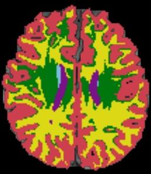 |  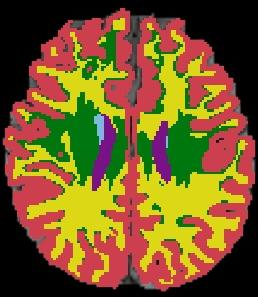
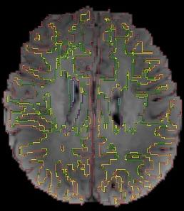  |  

Dice coefficient: 0.913313858189733

## 8mo_Template01

Ground-truth sagittal       |  Inferred sagittal
:-------------------------:|:-------------------------:
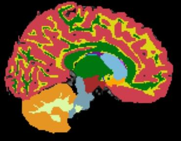  |  
  |  

Ground-truth coronal       |  Inferred coronal
:-------------------------:|:-------------------------:
  |  
  |  

Ground-truth axial       |  Inferred axial
:-------------------------:|:-------------------------:
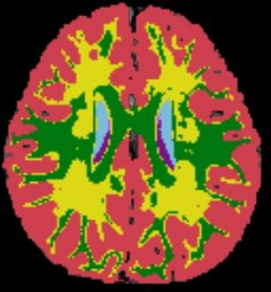 |  
  |  

Dice coefficient: 0.8987183567711018

## Other test cases

| Test case      | Dice coefficient | 
| ----------- | ----------- |
| 00-02mos_Template04      | 0.8989362179879133        |
| 00-02mos_Template17   | 0.9400775783859089        |
| 00-02mos_Template19 | 0.9315040524238632         |
| 8mo_Template07 | 0.8579367247861686         |
| 8mo_Template09 | 0.878052172240119         |
