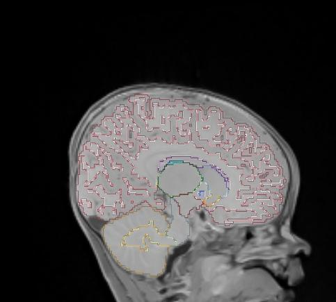

# Task506_AllAgesSkulls1LabToImImage

## Training

I trained this nnU-Net model on 14 training cases of 1- to 7-month-old babies with skulls.
The original data is available 
[here](https://umn.app.box.com/folder/143693300383?s=npitfaxq4udspe1phscihl6gvb9uvihh).
To be compatible with nnU-Net file/folder structure and naming requirements, the data
was copied to

    /home/feczk001/shared/data/nnUNet/nnUNet_raw_data_base/nnUNet_raw_data/Task506_AllAgesSkulls1LabToImImage

Files had to be renamed for nnU-Net, but the new names code up enough information to easily match them with the original files.

The age distribution for the training set was:

| Age (months)      | training set count | 
| ----------- | ----------- |
| 1  | 1        |
| 2 | 2         |
| 4 | 1         |
| 5 | 2         |
| 6 | 2         |
| 7 | 2         |

I then used `lab2im` to double the training set size.  I created one artificial set of
T1, T2, and labeled image for each original set of images.

## Test

Here we have the images layered (from top to bottom):

1. Segmentation (100% opacity)
2. T1 (50% opacity)
3. T2

I also added smoothing.

### 1 month: Subject 375518

Ground-truth sagittal       |  Predicted sagittal
:-------------------------:|:-------------------------:
  |  
  |  

Ground-truth coronal       |  Predicted coronal
:-------------------------:|:-------------------------:
  |  
  |  

Ground-truth axial       |  Predicted axial
:-------------------------:|:-------------------------:
  |  
  |  

Dice coefficient: 0.3633991985698166

### 2 months: Subject 627391

Ground-truth sagittal       |  Predicted sagittal
:-------------------------:|:-------------------------:
  |  
  |  

Ground-truth coronal       |  Predicted coronal
:-------------------------:|:-------------------------:
  |  
  |  

Ground-truth axial       |  Predicted axial
:-------------------------:|:-------------------------:
  |  
  |  

Dice coefficient: 0.8989465333315596

### 4 months: Subject 635515

Ground-truth sagittal       |  Predicted sagittal
:-------------------------:|:-------------------------:
  |  
  |  

Ground-truth coronal       |  Predicted coronal
:-------------------------:|:-------------------------:
  |  
  |  

Ground-truth axial       |  Predicted axial
:-------------------------:|:-------------------------:
  |  
  |  

Dice coefficient: 0.8246552166171827

### 5 months: Subject 272097

Ground-truth sagittal       |  Predicted sagittal
:-------------------------:|:-------------------------:
  |  
  |  

Ground-truth coronal       |  Predicted coronal
:-------------------------:|:-------------------------:
  |  
  |  

Ground-truth axial       |  Predicted axial
:-------------------------:|:-------------------------:
  |  
  |  

Dice coefficient: 0.8570650750027763

### 6 months: Subject 284149

Ground-truth sagittal       |  Predicted sagittal
:-------------------------:|:-------------------------:
  |  
  |  

Ground-truth coronal       |  Predicted coronal
:-------------------------:|:-------------------------:
  |  
  |  

Ground-truth axial       |  Predicted axial
:-------------------------:|:-------------------------:
  |  
  |  

Dice coefficient: 0.8626612873828671

### 7 months: Subject 710922

Ground-truth sagittal       |  Predicted sagittal
:-------------------------:|:-------------------------:
  |  
  |  

Ground-truth coronal       |  Predicted coronal
:-------------------------:|:-------------------------:
  |  
  |  

Ground-truth axial       |  Predicted axial
:-------------------------:|:-------------------------:
  |  
  |  

Dice coefficient: 0.34926525890771865
