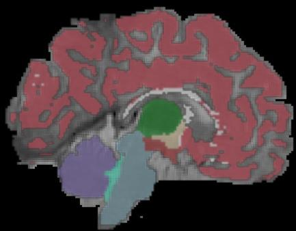

nnU-Net Segmentation of Baby MRI Images
========================================

The goal of the project is to segment MRI scans (both T1-weighted 
and T2-weighted) of babies both accurately and reasonably quickly.

Software considerations
-----------------------

If at all possible, I wanted to use a well-established code base,
rather than write something from scratch.  I consulted the
[Papers with Code](https://paperswithcode.com/task/brain-segmentation) 
site for candidate software.  My first choice was 
[BBillot / SynthSeg](https://github.com/BBillot/SynthSeg).
Unfortunately, I ran into a [problem](https://github.com/BBillot/SynthSeg/issues/11) in using it.
I found out today that this problem was fixed an hour ago.  I
hope to go back to SynthSeg and try it again.

My second choice was [MIC-DKFZ / nnU-Net](https://github.com/MIC-DKFZ/nnUNet).
I also ran into many difficult problems in running nn-UNet
but these were due to MSI software and configuration problems and not due to the
nnU-Net code itself.  However, these were all resolved within a
week (or three) by working with MSI.  Some time was also spent
in finding the best SLURM parameters to optimize the running time
for training.

Initial data set
----------------

Because of all the unknowns and lack of knowledge of run-time
for training, I wanted to start with small training/validation/test
sets.  I wasn't expecting great results with this small training
set, but I did want to make sure that I could get nn-UNet to run
efficiently on MSI.  That was accomplished.  Because of [nn-UNet's
good results on other medical image segmentation problems](https://arxiv.org/pdf/1809.10486v1.pdf)
I am confident we will get good results with a sufficiently
large training set.

I used the following images given to me by Luci Moore:
* Training set
    * 00-02mos_Template01
    * 00-02mos_Template04
    * 00-02mos_Template07
    * 00-02mos_Template08
* Test set
    * 00-02mos_Template05

Run-time
--------

Training consists of five folds each of 1000 epochs.  Once
the first fold has done some preliminary set-up, the folds can be
run in parallel.  From [examination of log files](https://github.com/DCAN-Labs/abcd-nn-unet/blob/main/nnunet/util/calculate_epoch_time.py),
we get the following statistics:

  * Training/crossvalidation set of size 4

    min_epoch_time: 240.548288 s
    max_epoch_time: 389.860017 s
    avg_epoch_time: 294.7903675987501 s

  * Training/crossvalidation set of size 8

    min_epoch_time: 247.918437
    max_epoch_time: 357.954143
    avg_epoch_time: 280.5509568585713

Hence, total running time for all training
should [take about 3 days](https://www.wolframalpha.com/input/?i=1000+*+294.7903675987501+seconds)
for a training/cross-validation size of 5.

Inference time for one set of T1/T2 images takes about 2 minutes.

I spent a lot of time on optimizing the MSI
parameters to match the 
[benchmark run-times](https://github.com/MIC-DKFZ/nnUNet/blob/master/documentation/expected_epoch_times.md#pytorch-171-compiled-with-cudnn-81077).
I was able to get within a factor of two of 
the benchmark.  So it might be possible to halve
our current run-time.  My experiments with
optimizing parameters are documented 
[here](./params-vs-epoch-time.csv).  The best
set of parameters I could find for MSI are
in [this SLURM script](../slurm/train/RunNnUnetTrain_102_0.sh).

Results
-------

Below are the manual (i.e., ground-truth) segmentations and the segmentations
inferred by the model trained by nnU-Net.

### Images

#### Segmentation superimposed on T1 and T2 images

Here we have the images layered (from top to bottom):

1. Segmentation (50% opacity)
2. T1 (50% opacity)
3. T2

I also added smoothing.

#### 00-02mos_Template05

Ground-truth coronal       |  Inferred coronal
:-------------------------:|:-------------------------:
  |  

Ground-truth sagittal       |  Inferred sagittal
:-------------------------:|:-------------------------:
  |  

Ground-truth axial       |  Inferred axial
:-------------------------:|:-------------------------:
  |  

#### 8mo_Template09

This nnU-Net was trained on 8 training/cross-validation cases of 8-month-old babies.

The T1, T2, and manually segmented (a.k.a. "ground truth") files are here:

    * /home/feczk001/shared/data/nnUNet/segmentations/JLF_templates_testing/wm_JLF_atlases/8mo/Template09/

The nnU-Net inferred segmentation is available here:

    * /home/feczk001/shared/data/nnUNet/segmentations/inferred/Task500_Babies8Mo/8mo_Template09.nii.gz

Ground-truth coronal       |  Inferred coronal
:-------------------------:|:-------------------------:
  |  

Ground-truth sagittal       |  Inferred sagittal
:-------------------------:|:-------------------------:
  |  

Ground-truth axial       |  Inferred axial
:-------------------------:|:-------------------------:
  |  

##### Outline

Ground-truth coronal       |  Inferred coronal
:-------------------------:|:-------------------------:
  |  

Ground-truth sagittal       |  Inferred sagittal
:-------------------------:|:-------------------------:
  |  

Ground-truth axial       |  Inferred axial
:-------------------------:|:-------------------------:
  |  

### Dice coefficients

I used the 
[Dice coefficient](https://towardsdatascience.com/metrics-to-evaluate-your-semantic-segmentation-model-6bcb99639aa2#:~:text=Simply%20put%2C%20the%20Dice%20Coefficient,Illustration%20of%20Dice%20Coefficient.) to measure results.
This is the usual standard for measuring the 
'accuracy' of medical image segmentations.
The 
[Dice coefficient on our single test set](../nnunet/evaluation/dice.py) is
0.7347411676344301.  However, this is misleading.  The fraction of 
voxels with the label 0 (background) is
0.7297995117701617.  The Dice coefficient
for foreground voxels is only 0.03424693173990132.
Again, we shouldn't expect great results with
a training set size of 5.  Some training set
sizes used to get good results with nnU-Net are
* heart: 30
* hippocampus: 394
* prostate: 47
* lungs: 96

The Dice coefficient for 8-month-olds for foreground classes is: 0.9206427375735695

Future directions
-----------------

1. Increase the training set size.  We currently
have about 20 subjects total.  I would recommend first trying a training set of size 10.  If nnU-Net scales linearly, this will take about 6 days to run.  Keep doubling the training set size until we're using all the data.  Establish the relationship between training set size and the resulting run-time and Dice coefficient.
2. If we don't get good results with a sufficiently large training set, go back and try SynthSeg or perhaps a third application.

Conclusions
-----------

Given the results of nnU-Net on various medical
image segmentation tasks, I'm confident that
nnU-Net will do well with a sufficiently large
training set of baby T1 and T2 images that are
well-labelled.  How large that set must be
remains to be seen.  Also, we need separate sets of images for separate age groups.  There are two practical
considerations for finishing this project:
manually creating the segmented data, and
the run-time for training on this data.  As I mentioned
earlier, it might be possible to halve the 
training run-time.  I can continue experimenting with the 
MSI parameters, or we could consult with MSI (the latter might be quicker).
Also, once we seem to have reached a plateau
with Dice coefficients, there are methods
for 
[extending and changing nnU-Net](https://github.com/MIC-DKFZ/nnUNet/blob/master/documentation/extending_nnunet.md#extendingchanging-nnu-net) that could
better our results.
