`im2lab` generated images for Task 506
====================================

There are two parameters for which I did not use default parameter values:

* prior_distribution
* generation_classes

`prior_distribution`
------------------

    # We specify here that we type of prior distributions to sample the GMM parameters.
    # By default prior_distribution is set to 'uniform', and in this example we want to change it to 'normal'.
    prior_distribution = 'normal'

`generation_classes`
------------------

For any two anatomical regions that have both a left hemisphere component and a right
hemisphere component, we put those two components in the same generation class.
For example, the generation class of both Left-Cerebral-Exterior and Right-Cerebral-Exterior
is 8.

    # we regroup structures into K classes, so that they share the same distribution for image generation
    # We regroup labels with similar tissue types into K "classes", so that intensities of similar regions are sampled
    # from the same Gaussian distribution. This is achieved by providing a list indicating the class of each label.
    # It should have the same length as generation_labels, and follow the same order. Importantly the class values must
    # be between 0 and K-1, where K is the total number of different classes.
    #
    # Example: (continuing the previous one)  generation_labels = [0, 24, 507, 2, 3, 4, 17, 25, 41, 42, 43, 53, 57]
    #                                        generation_classes = [0,  1,   2, 3, 4, 5,  4,  6,  7,  8,  9,  8, 10]
    # In this example labels 3 and 17 are in the same *class* 4 (that has nothing to do with *label* 4), and thus will
    # be associated to the same Gaussian distribution when sampling the GMM.
    generation_classes = np.array(
        [0,  # background
         1,  # CSF
         2,  # 3rd-Ventricle
         3,  # 4th-Ventricle
         4,  # Brain-Stem
         5,  # WM-hypointensities
         6,  # Optic-Chiasm
         7,  # Vermis
         8,  # Left-Cerebral-Exterior
         9,  # Left-Cerebral-White-Matter
         10,  # Left-Cerebral-Cortex
         11,  # Left-Lateral-Ventricle
         12,  # Left-Inf-Lat-Vent
         13,  # Left-Cerebellum-Exterior
         14,  # Left-Cerebellum-White-Matter
         15,  # Left-Cerebellum-Cortex
         16,  # Left-Thalamus-Proper
         17,  # Left-Caudate
         18,  # Left-Putamen
         19,  # Left-Pallidum
         20,  # Left-Hippocampus
         21,  # Left-Amygdala
         22,  # Left-Accumbens-area
         23,  # Left-VentralDC
         24,  # Left-vessel
         25,  # Left-choroid-plexus
         8,  # Right-Cerebral-Exterior
         9,  # Right-Cerebral-White-Matter
         10,  # Right-Cerebral-Cortex
         11,  # Right-Lateral-Ventricle
         12,  # Right-Inf-Lat-Vent
         13,  # Right-Cerebellum-Exterior
         14,  # Right-Cerebellum-White-Matter
         15,  # Right-Cerebellum-Cortex
         16,  # Right-Thalamus-Proper
         17,  # Right-Caudate
         18,  # Right-Putamen
         19,  # Right-Pallidum
         20,  # right hippocampus
         21,  # Right-Amygdala
         22,  # Right-Accumbens-area
         23,  # Right-VentralDC
         24,  # Right-vessel
         25])  # Right-choroid-plexus

Examples
-------

### 1mo_sub-198549

| Type | Sagittal      | Coronal | Axial |
| -----| ----------- | ----------- | ----------- |
| input labelled | 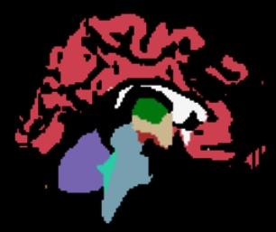 | 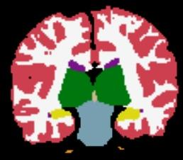 | 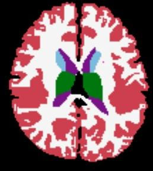 |
| output labelled (normal_prior_distribution) | 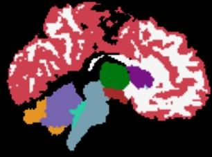 | 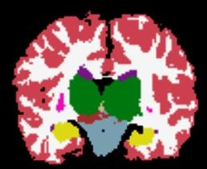 | 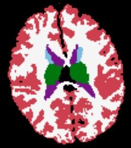 |
| output T1 | 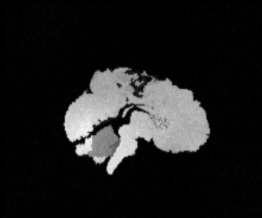 | 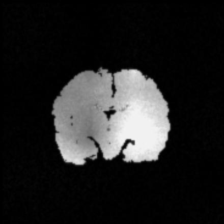 | 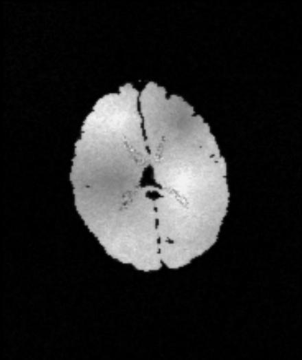 |
| output T2| 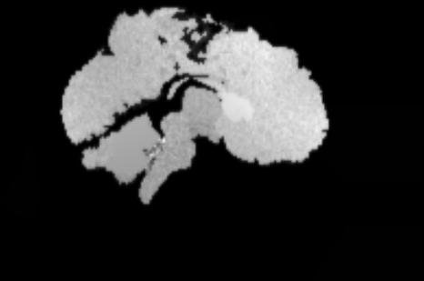 | 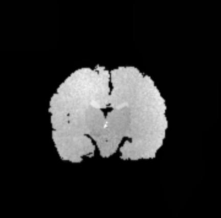 | 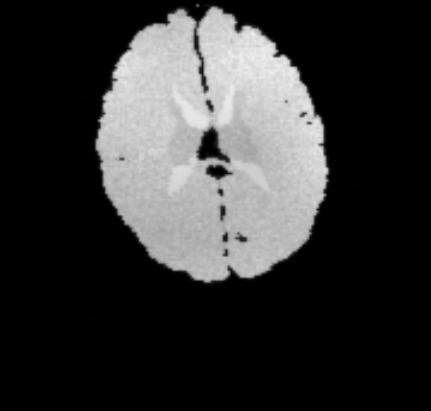 |

### 5mo_sub-176427

| Type | Sagittal      | Coronal | Axial |
| -----| ----------- | ----------- | ----------- |
| input labelled | 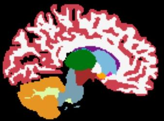 | 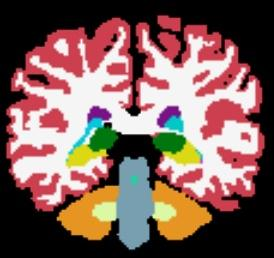 | 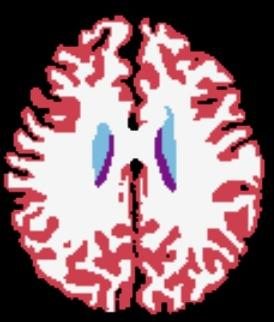 |
| output labelled | 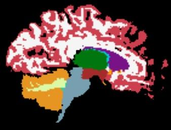 | 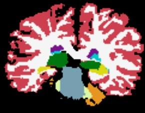 | 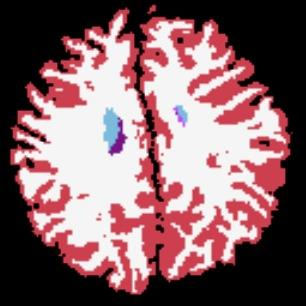 |
| output T1 | 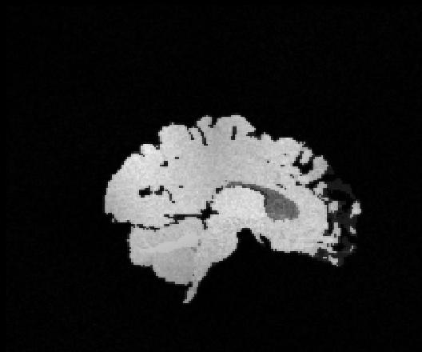 | 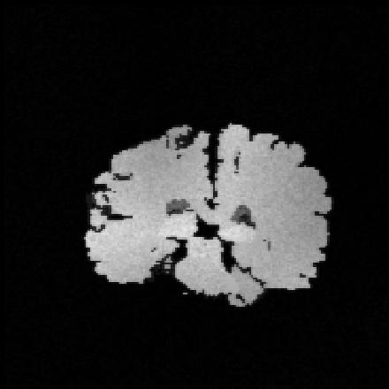 | 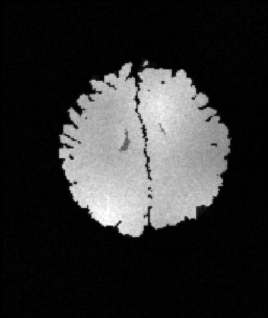 |
| output T2| 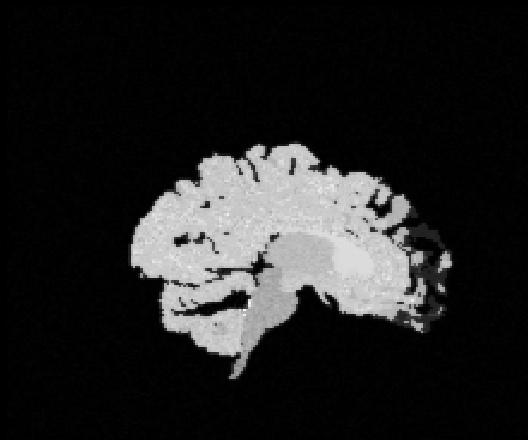 | 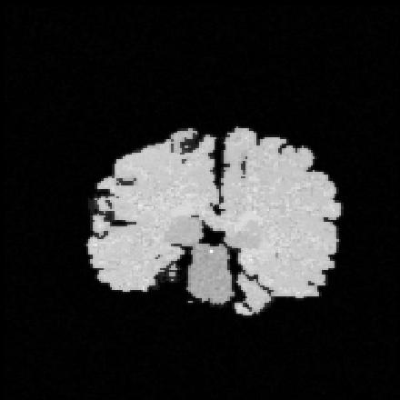 | 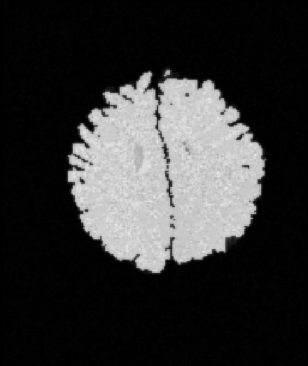 |

### 7mo_sub-439083

| Type | Sagittal      | Coronal | Axial |
| -----| ----------- | ----------- | ----------- |
| input labelled | 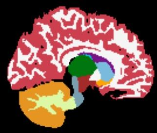 | 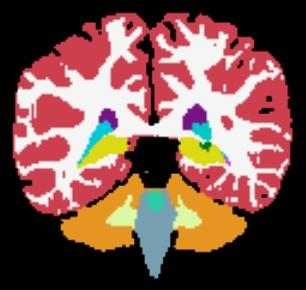 | 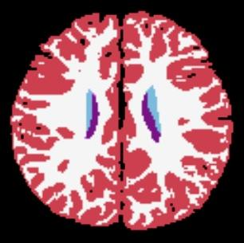 |
| output labelled | 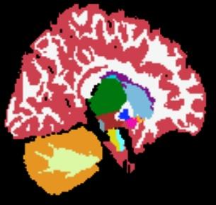 | 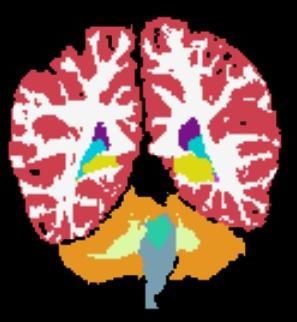 | 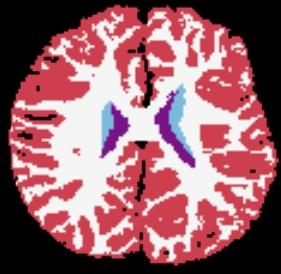 |
| output T1 | 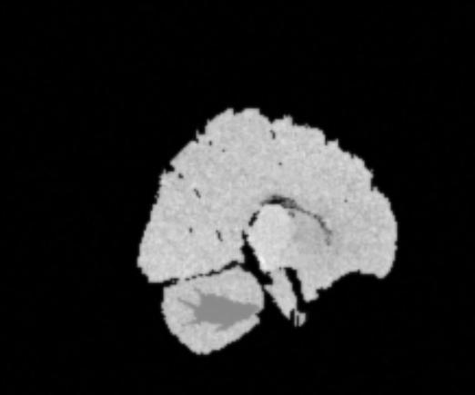 | 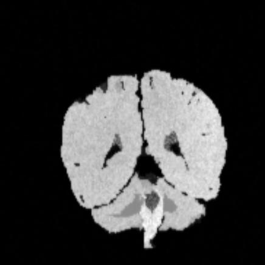 | 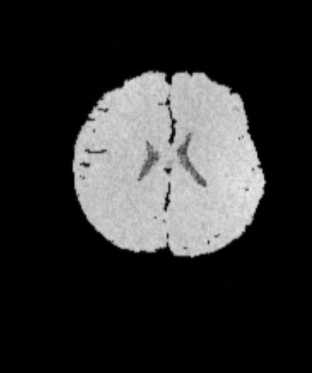 |
| output T2| 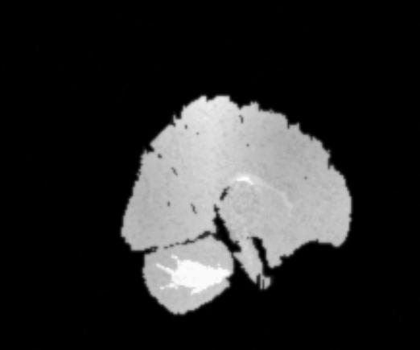 | 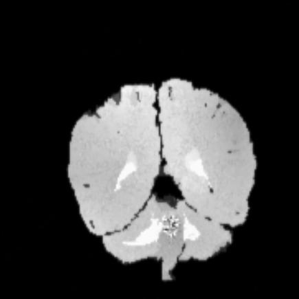 | 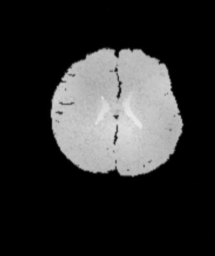 |
