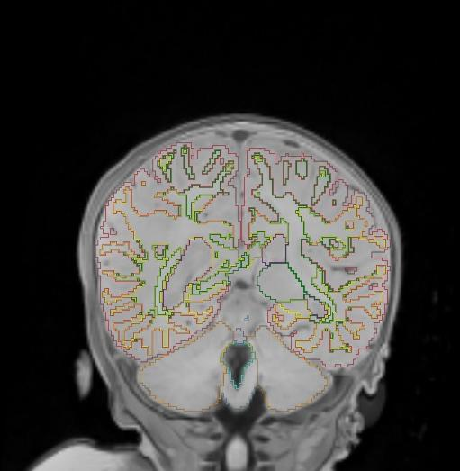

# subjects_to_edit

The nnU-Net inferred segmentations are available here:

    * /home/feczk001/shared/data/nnUNet/segmentations/inferred/subjects_to_edit/

## Images

Here we have the images layered (from top to bottom):

1. Segmentation (50--100% opacity)
2. T1 (50% opacity)
3. T2

I also added smoothing.

### 2 months

#### sub-684448

Predicted sagittal       |  Predicted coronal | Predicted axial
:-------------------------:|:-------------------------:|:-------------------------:
  |    |  
  |    |  

### 3 months

#### sub-116056

Predicted sagittal       |  Predicted coronal | Predicted axial
:-------------------------:|:-------------------------:|:-------------------------:
  |    |  
  |    |  

#### sub-116845

Predicted sagittal       |  Predicted coronal | Predicted axial
:-------------------------:|:-------------------------:|:-------------------------:
  |    |  
  |    |  

### 4 months

#### sub-584381

Predicted sagittal       |  Predicted coronal | Predicted axial
:-------------------------:|:-------------------------:|:-------------------------:
  |    |  
  |    |  

#### sub-645257

Predicted sagittal       |  Predicted coronal | Predicted axial
:-------------------------:|:-------------------------:|:-------------------------:
  |    |  
  |    |  

### 7 months

#### sub-402408

Predicted sagittal       |  Predicted coronal | Predicted axial
:-------------------------:|:-------------------------:|:-------------------------:
  |    |  
  |    |  
