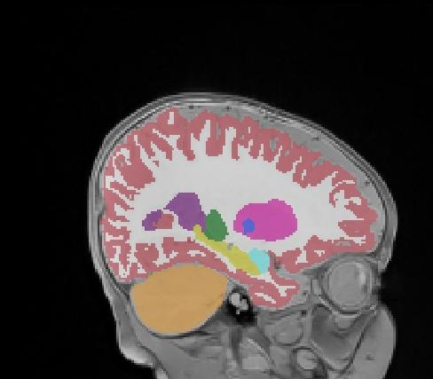
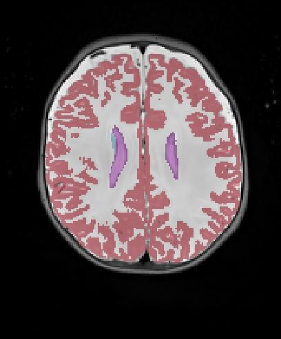
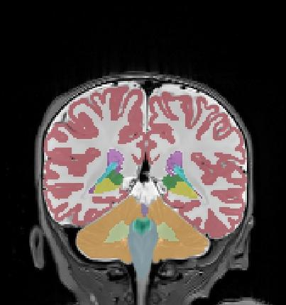

### 4 month: Subject 1
#### Dice (foreground): 0.84

|             | coronal     | sagittal (75) | axial
| ----------- | ----------- | ---- | --- 
| ground-truth      |         |  | 
| predicted   |         |  | 
