% Segmentation with deep learning
% Paul Reiners
% 10/20/2021

### BCP_ABCD_Neonates_Augmentation

* Deep learning segmentation with `nnU-Net` and `lab2im`
* **avg dice: 0.88**
* 5 augmented images per genuine image

---

### 0 month: Template 19
#### Dice (foreground): 0.89

|             | coronal     | sagittal (45) | axial
| ----------- | ----------- | ---- | --- 
| ground-truth      | 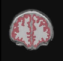        | 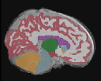 | 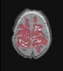
| predicted   |         | 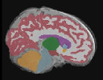 | 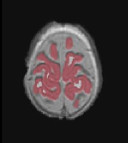

---

### 4 month: Subject 1
#### Dice (foreground): 0.84

|             | coronal     | sagittal (75) | axial
| ----------- | ----------- | ---- | --- 
| ground-truth      |         | 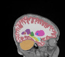 | 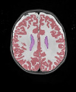
| predicted   | 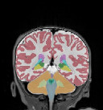        | 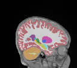 | 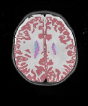

---

### 8 month: Subject 1
#### Dice (foreground): 0.90

|             | coronal     | sagittal (75) | axial
| ----------- | ----------- | ---- | --- 
| ground-truth      | 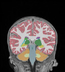        | 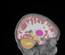 | 
| predicted   | 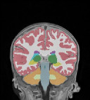        | 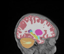 | 
