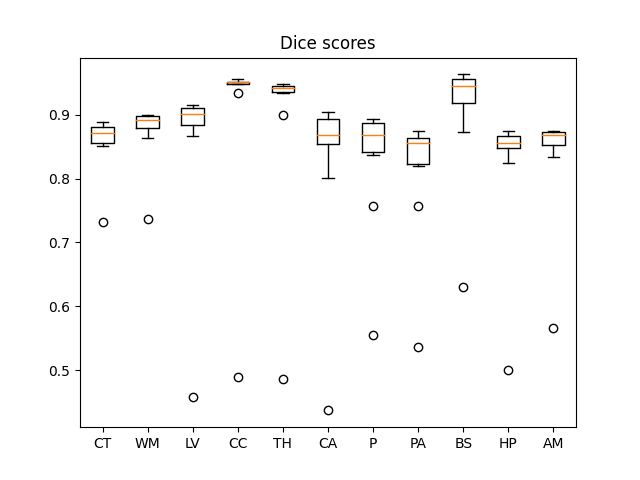

Task512_BCP_ABCD_Neonates_SynthSegDownsample
=============================================

Dice coefficient: 0.8698812664514566
-----------------

### SynthSeg settings

    downsample=True
    prior_distributions='normal'

### Summary

| segment_name      | Dice |
| ----------- | ----------- |
| Cerebral-White-Matter | 0.7418461715565524
| Cerebral-Cortex | 0.7012721297438969
| Lateral-Ventricle | 0.6215763253561358
| Cerebellum-Cortex | 0.7033500374650061
| Thalamus-Proper* | 0.6423429145582489
| Caudate | 0.6373431224099957
| Putamen | 0.684560795882228
| Pallidum | 0.6403555260799341
| 3rd-Ventricle | 0.8769779276317535
| 4th-Ventricle | 0.8472866893067705
| Brain-Stem | 0.9078272367621212
| Hippocampus | 0.7049890187448682
| Amygdala | 0.6839130294749083
| Accumbens-area | 0.3630193559324584
| VentralDC | 0.5314293312637872 |

* [Detailed statistics stratified by anatomical region](means.csv)
