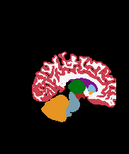
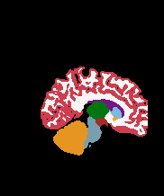
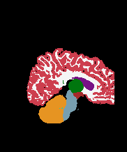
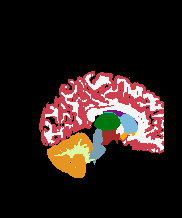
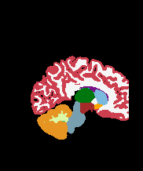

Task512_BCP_ABCD_Neonates_SynthSegDownsample
=============================================

Dice coefficient: 0.853262030191724
-----------------

### nnU-Net settings
    "modality": {
        "0": "T1",
        "1": "T2"
    },

### SynthSeg settings

    downsample=True
    prior_distributions='normal'

### Summary

| segment_name      | Dice |
| ----------- | ----------- |
| Cerebral-White-Matter | 0.8569272769753329 | 
| Cerebral-Cortex | 0.8397469274483849 |
| Lateral-Ventricle | 0.8038140272934797 |
| Cerebellum-Cortex | 0.8678992501253581 |
| Thalamus-Proper* | 0.8496686503956972 |
| Caudate | 0.7847380414558429 |
| Putamen | 0.7906269525966562 |
| Pallidum | 0.7536450702975441 |
| 3rd-Ventricle | 0.8769779276317535 |
| 4th-Ventricle | 0.8472866893067705 |
| Brain-Stem | 0.9078272367621212 |
| Hippocampus | 0.7973869532268174 |
| Amygdala | 0.7941830548737976 |
| Accumbens-area | 0.5994838698375999 |
| VentralDC | 0.7839104355039526 |

* [Detailed statistics stratified by anatomical region](means.csv)

### 0 month: Template 19

Ground-truth coronal       |  Predicted coronal
:-------------------------:|:-------------------------:
  |  

Ground-truth sagittal       |  Predicted sagittal
:-------------------------:|:-------------------------:
  |  

Ground-truth axial       |  Predicted axial
:-------------------------:|:-------------------------:
  |  

Dice (foreground): 0.88

### 0 month: Template 20

Ground-truth coronal       |  Predicted coronal
:-------------------------:|:-------------------------:
  |  

Ground-truth sagittal       |  Predicted sagittal
:-------------------------:|:-------------------------:
  |  

Ground-truth axial       |  Predicted axial
:-------------------------:|:-------------------------:
  |  

Dice (foreground): 0.89

### 1 month

Ground-truth coronal       |  Predicted coronal
:-------------------------:|:-------------------------:
  |  

Ground-truth sagittal       |  Predicted sagittal
:-------------------------:|:-------------------------:
  |  

Ground-truth axial       |  Predicted axial
:-------------------------:|:-------------------------:
  |  

Dice (foreground): 0.90

### 2 month

Ground-truth coronal       |  Predicted coronal
:-------------------------:|:-------------------------:
  |  

Ground-truth sagittal       |  Predicted sagittal
:-------------------------:|:-------------------------:
  |  

Ground-truth axial       |  Predicted axial
:-------------------------:|:-------------------------:
  |  

Dice (foreground): 0.91

### 3 month

Ground-truth coronal       |  Predicted coronal
:-------------------------:|:-------------------------:
  |  

Ground-truth sagittal       |  Predicted sagittal
:-------------------------:|:-------------------------:
  |  

Ground-truth axial       |  Predicted axial
:-------------------------:|:-------------------------:
  |  

Dice (foreground): 0.59

### 4 month

Ground-truth coronal       |  Predicted coronal
:-------------------------:|:-------------------------:
  |  

Ground-truth sagittal       |  Predicted sagittal
:-------------------------:|:-------------------------:
  |  

Ground-truth axial       |  Predicted axial
:-------------------------:|:-------------------------:
  |  

Dice (foreground): 0.83

### 5 month

Ground-truth coronal       |  Predicted coronal
:-------------------------:|:-------------------------:
  |  

Ground-truth sagittal       |  Predicted sagittal
:-------------------------:|:-------------------------:
  |  

Ground-truth axial       |  Predicted axial
:-------------------------:|:-------------------------:
  |  

Dice (foreground): 0.85

### 6 month

Ground-truth coronal       |  Predicted coronal
:-------------------------:|:-------------------------:
  |  

Ground-truth sagittal       |  Predicted sagittal
:-------------------------:|:-------------------------:
  |  

Ground-truth axial       |  Predicted axial
:-------------------------:|:-------------------------:
  |  

Dice (foreground): 0.90

### 7 month

Ground-truth coronal       |  Predicted coronal
:-------------------------:|:-------------------------:
  |  

Ground-truth sagittal       |  Predicted sagittal
:-------------------------:|:-------------------------:
  |  

Ground-truth axial       |  Predicted axial
:-------------------------:|:-------------------------:
  |  

Dice (foreground): 0.90

### 8 month

Ground-truth coronal       |  Predicted coronal
:-------------------------:|:-------------------------:
  |  

Ground-truth sagittal       |  Predicted sagittal
:-------------------------:|:-------------------------:
  |  

Ground-truth axial       |  Predicted axial
:-------------------------:|:-------------------------:
  |  

Dice (foreground): 0.89
