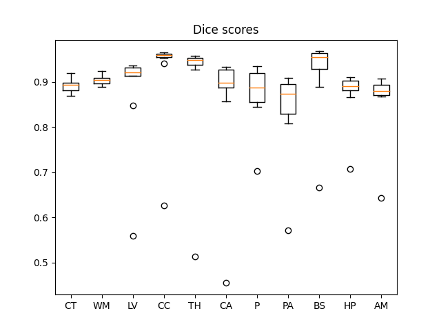
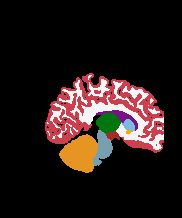
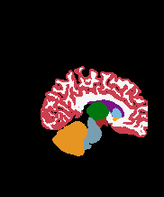
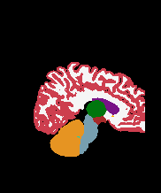
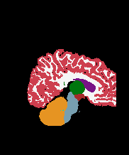
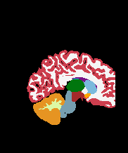
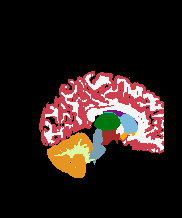

Task513_BCP_ABCD_Neonates_NoAugmentation
=============================================

Dice coefficient: 0.8914551963662968
------------------------------------

No image augmentation used.

Data
* Ground truth: /home/feczk001/shared/data/nnUNet/labelsTs/Task513/
* Inferred labels: /home/feczk001/shared/data/nnUNet/segmentations/inferred/Task513_BCP_ABCD_Neonates_NoAugmentation/
* T1/T2 files: /home/feczk001/shared/data/nnUNet/nnUNet_raw_data_base/nnUNet_raw_data/Task513_BCP_ABCD_Neonates_NoAugmentation/imagesTs/

### Summary

| segment_name      | Dice |
| ----------- | ----------- |
| Cerebral-White-Matter | 0.9010252417222017 |
| Cerebral-Cortex | 0.8838604023827037 |
| Lateral-Ventricle | 0.8336301190480986 |
| Cerebellum-Cortex | 0.886660884673938 |
| Thalamus-Proper* | 0.8633612312632395 |
| Caudate | 0.8060475048688807 |
| Putamen | 0.8253455050071072 |
| Pallidum | 0.7877863025539595 |
| 3rd-Ventricle | 0.9009574669936448 |
| 4th-Ventricle | 0.8667167442522169 |
| Brain-Stem | 0.9186869536000692 |
| Hippocampus | 0.8457031087101365 |
| Amygdala | 0.8126397860534964 |
| Accumbens-area | 0.6165002122308456 |
| VentralDC | 0.7988042443495789 |

* [Detailed statistics stratified by anatomical region](means.csv)

### 0 month: Template 19

Ground-truth coronal       |  Predicted coronal
:-------------------------:|:-------------------------:
  |  

Ground-truth sagittal       |  Predicted sagittal
:-------------------------:|:-------------------------:
  |  

Ground-truth axial       |  Predicted axial
:-------------------------:|:-------------------------:
  |  

Dice (foreground): 0.90

### 0 month: Template 20

Ground-truth coronal       |  Predicted coronal
:-------------------------:|:-------------------------:
  |  

Ground-truth sagittal (TODO Improve image)      |  Predicted sagittal (TODO Improve image)
:-------------------------:|:-------------------------:
  |  

Ground-truth axial       |  Predicted axial
:-------------------------:|:-------------------------:
  |  

Dice (foreground): 0.91

### 1 month

Ground-truth coronal       |  Predicted coronal
:-------------------------:|:-------------------------:
  |  

Ground-truth sagittal       |  Predicted sagittal
:-------------------------:|:-------------------------:
  |  

Ground-truth axial       |  Predicted axial
:-------------------------:|:-------------------------:
  |  

Dice (foreground): 0.91

### 2 month

Ground-truth coronal       |  Predicted coronal
:-------------------------:|:-------------------------:
  |  

Ground-truth sagittal       |  Predicted sagittal
:-------------------------:|:-------------------------:
  |  

Ground-truth axial       |  Predicted axial
:-------------------------:|:-------------------------:
  |  

Dice (foreground): 0.91

### 3 month

Ground-truth coronal       |  Predicted coronal
:-------------------------:|:-------------------------:
  |  

Ground-truth sagittal       |  Predicted sagittal
:-------------------------:|:-------------------------:
  |  

Ground-truth axial       |  Predicted axial
:-------------------------:|:-------------------------:
  |  

Dice (foreground): 0.83

### 4 month

Ground-truth coronal       |  Predicted coronal
:-------------------------:|:-------------------------:
  |  

Ground-truth sagittal       |  Predicted sagittal
:-------------------------:|:-------------------------:
  |  

Ground-truth axial       |  Predicted axial
:-------------------------:|:-------------------------:
  |  

Dice (foreground): 0.88

### 5 month

Ground-truth coronal       |  Predicted coronal
:-------------------------:|:-------------------------:
  |  

Ground-truth sagittal       |  Predicted sagittal
:-------------------------:|:-------------------------:
  |  

Ground-truth axial       |  Predicted axial
:-------------------------:|:-------------------------:
  |  

Dice (foreground): 0.85

### 6 month

Ground-truth coronal       |  Predicted coronal
:-------------------------:|:-------------------------:
  |  

Ground-truth sagittal       |  Predicted sagittal
:-------------------------:|:-------------------------:
  |  

Ground-truth axial       |  Predicted axial
:-------------------------:|:-------------------------:
  |  

Dice (foreground): 0.92

### 7 month

Ground-truth coronal       |  Predicted coronal
:-------------------------:|:-------------------------:
  |  

Ground-truth sagittal       |  Predicted sagittal
:-------------------------:|:-------------------------:
  |  

Ground-truth axial       |  Predicted axial
:-------------------------:|:-------------------------:
  |  

Dice (foreground): 0.91

### 8 month

Ground-truth coronal       |  Predicted coronal
:-------------------------:|:-------------------------:
  |  

Ground-truth sagittal       |  Predicted sagittal
:-------------------------:|:-------------------------:
  |  

Ground-truth axial       |  Predicted axial
:-------------------------:|:-------------------------:
  |  

Dice (foreground): 0.90
