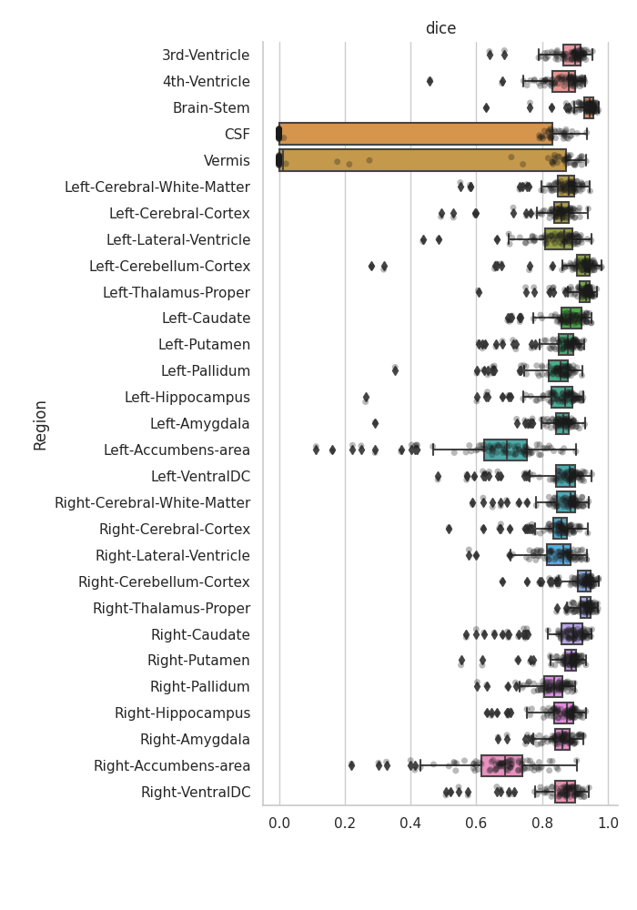
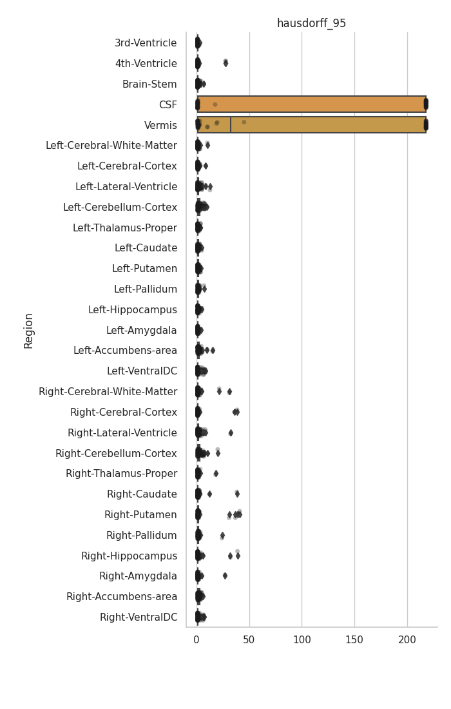
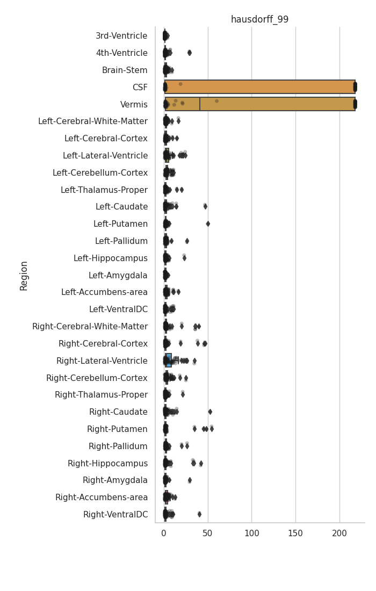
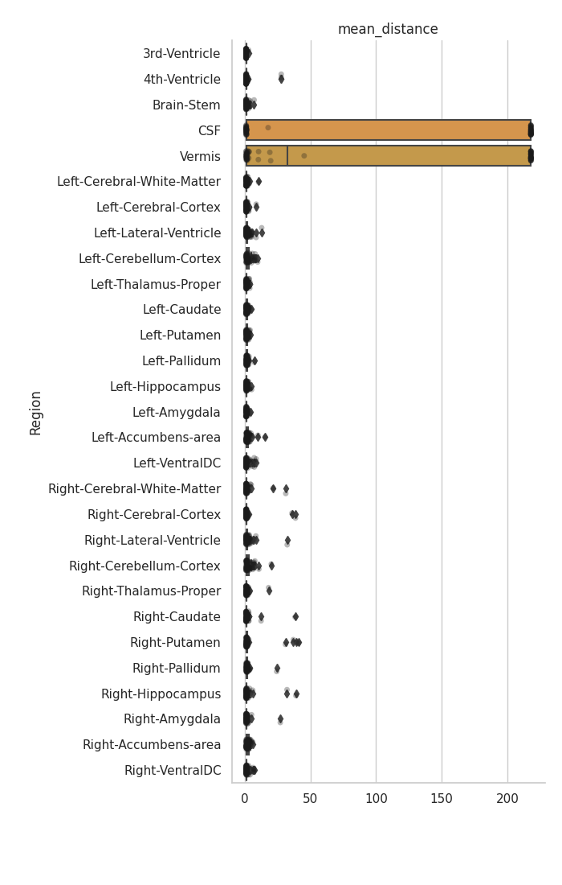

Tasks 516--525
==============

dice
----

    mislabeled_as_left_thalamus_proper: {'Left-Cerebral-White-Matter': 13709, 'Right-Thalamus-Proper': 7226, 'Left-VentralDC': 3886, 'Left-Lateral-Ventricle': 3497, 'Unknown': 3013, 'Left-choroid-plexus': 1577, 'Left-Hippocampus': 1559, 'Brain-Stem': 1074, 'CSF': 917, '3rd-Ventricle': 877, 'Left-Caudate': 794, 'Left-Cerebral-Cortex': 478, 'Right-VentralDC': 326, 'Right-Caudate': 60, 'Right-Hippocampus': 51, 'Right-Lateral-Ventricle': 50, 'Right-Cerebral-White-Matter': 37, 'Right-Pallidum': 13, 'Left-Pallidum': 2}
    not_labeled_as_left_thalamus_proper: {'Left-Cerebral-White-Matter': 14951, 'Right-Thalamus-Proper': 12074, 'Left-VentralDC': 4957, 'Left-Hippocampus': 3150, 'Unknown': 2325, 'Left-Lateral-Ventricle': 1660, 'Right-Cerebral-White-Matter': 1179, 'Brain-Stem': 1077, 'Left-Pallidum': 861, 'Left-choroid-plexus': 782, 'Left-Caudate': 751, '3rd-Ventricle': 672, 'CSF': 417, 'Right-Lateral-Ventricle': 101, 'Left-Putamen': 91, 'Right-VentralDC': 58, 'Right-Hippocampus': 50, 'Left-Cerebral-Cortex': 45, 'Right-Caudate': 26, 'Right-Pallidum': 8}

hausdorff
---------

hausdorff_95
------------

hausdorff_99
------------

mean_distance
-------------

