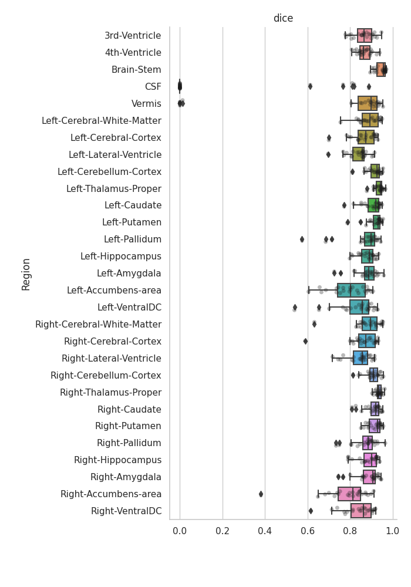

Task 527
========

527 was trained with a T1+T2 pair from HBCD.

The original data is from here
```
/scratch.global/lundq163/nnUNet_HBCD/nnUNet_raw_data_base/nnUNet_raw_data/Task527/
```

```
iou_median:        0.7921853510223594
dice_score_median: 0.8840431096012269
```
---

dice
----

