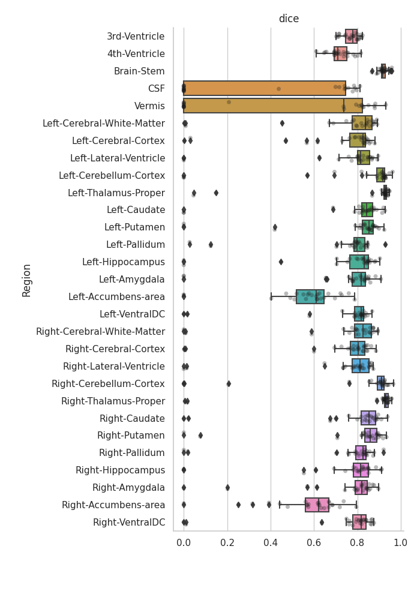
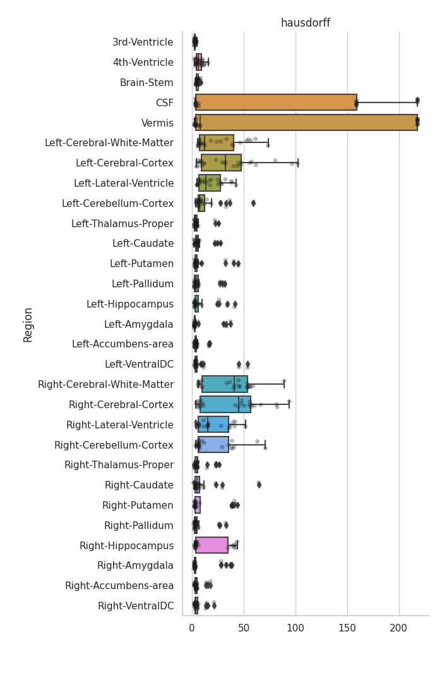
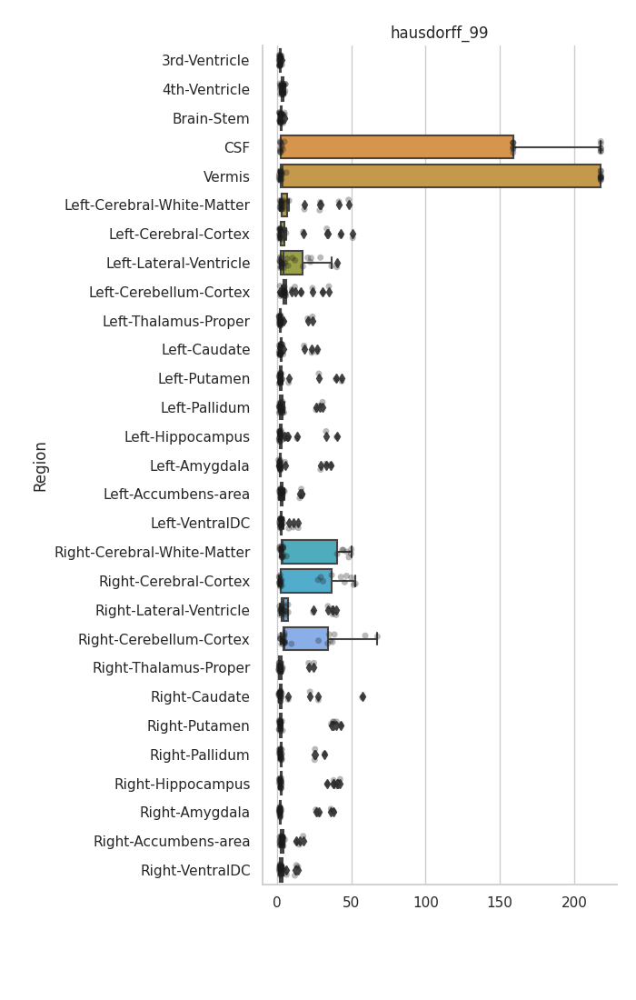
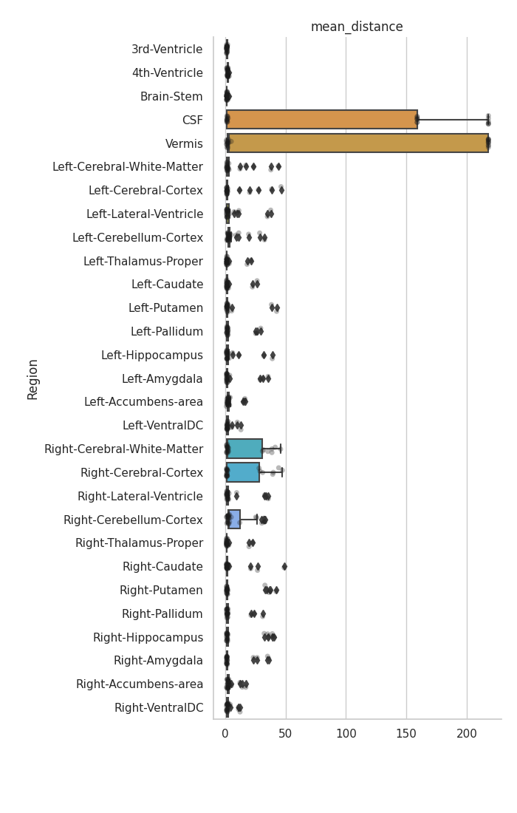

Task 551
==============

The results have not been chirality corrected.

This model is the same as 550 but with half as many synthetic images,
or about 5000 SynthSeg image per real image

    Dice score (median over subjects): 0.8298961283381148
    IoU (median over subjects:         0.7092499635530477

---

dice
----

hausdorff
---------

hausdorff_95
------------

hausdorff_99
------------

mean_distance
-------------

