# Task501_Babies_AllMonths

We used T1 and T2 images in this training set.

| Age (months)      | training set count | 
| ----------- | ----------- |
| 0&#8211;2      | 16        |
| 1  | 2        |
| 2 | 6         |
| 6 | 4         |
| 8 | 6         |

The T1, T2, and manually segmented (a.k.a. "ground truth") files are here:

    * /home/miran045/reine097/JLF_templates_testing/wm_JLF_atlases/

The nnU-Net inferred segmentations are available here:

    * /home/feczk001/shared/data/nnUNet/segmentations/inferred/Task501_Babies_AllMonths/

## Training subjects

The data is contained in these Box folders:

* [1mo&#8211;8mo](https://umn.app.box.com/folder/135725640186)
* [00-02mos](https://umn.app.box.com/folder/113218745237)

Here are the subjects in the training data:

* 00-02mos
    * Template01 
    * Template03
    * Template05
    * Template06
    * Template07 
    * Template08
    * Template09	
    * Template10
    * Template11
    * Template12
    * Template13 
    * Template14 
    * Template15
    * Template16
    * Template18
    * Template20	
* 1mo
    * Template01
    * Template02
* 2mo
    * Template01
    * Template02
    * Template03
    * Template04 
    * Template05
    * Template07
* 6mo
    * Template01
    * Template02
    * Template03
    * Template04  
* 8mo
    * Template02
    * Template03
    * Template04
    * Template05
    * Template06
    * Template08

Here are the subjects in the test data:

* 00-02mos
    * Template02  
    * Template04 
    * Template17 
    * Template19
* 2mo
    * Template06_0001.nii.gz  
* 8mo
    * Template01  
    * Template07  
    * Template09

## Images

### Segmentation superimposed on T1 and T2 images

Below are the manual (i.e., ground-truth) segmentations and the segmentations
inferred by the model trained by nnU-Net.*

Here we have the images layered (from top to bottom):

1. Segmentation (100% opacity)
2. T1 (50% opacity)
3. T2

I also added smoothing.

Ground-truth sagittal       |  Inferred sagittal
:-------------------------:|:-------------------------:
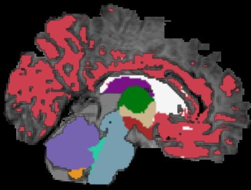  |  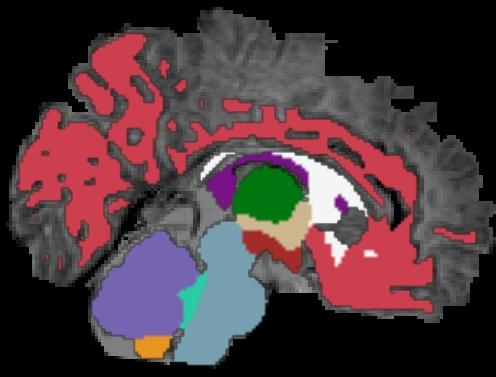
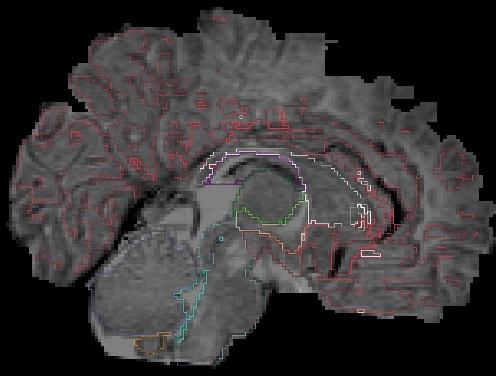  |  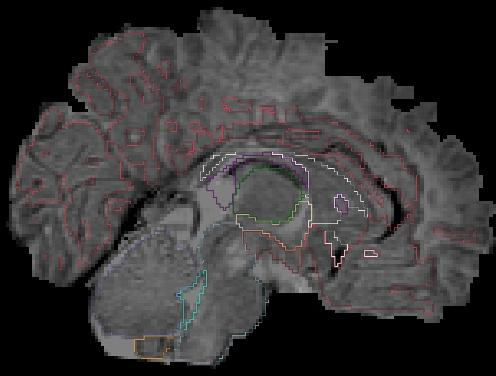

Ground-truth coronal       |  Inferred coronal
:-------------------------:|:-------------------------:
  |  
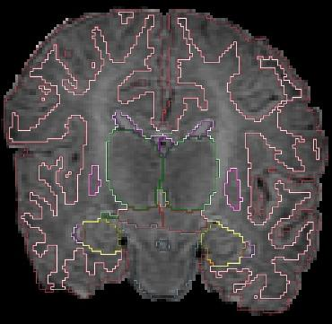  |  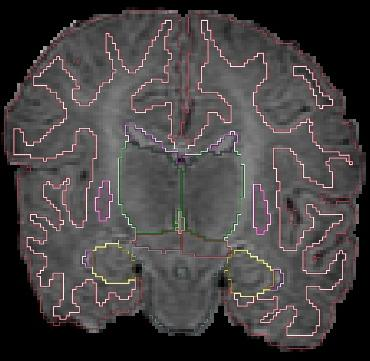

Ground-truth axial       |  Inferred axial
:-------------------------:|:-------------------------:
 |  
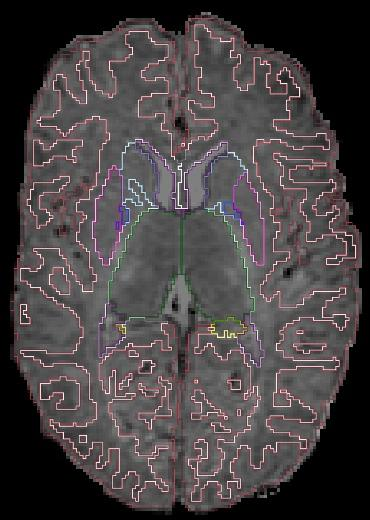  |  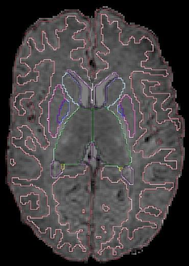

Dice coefficient: 0.9144429929377774

## 2mo_Template06

Ground-truth sagittal       |  Inferred sagittal
:-------------------------:|:-------------------------:
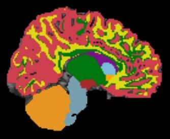  |  
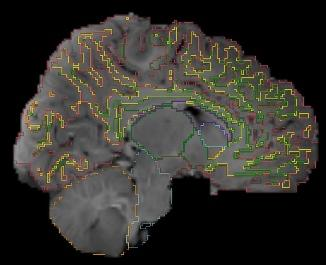  |  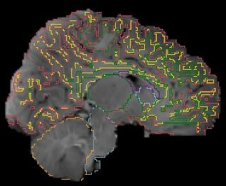

Ground-truth coronal       |  Inferred coronal
:-------------------------:|:-------------------------:
  |  
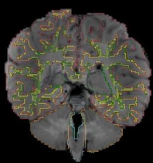  |  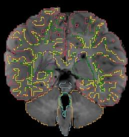

Ground-truth axial       |  Inferred axial
:-------------------------:|:-------------------------:
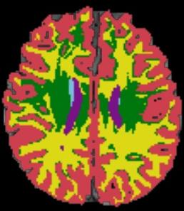 |  
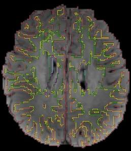  |  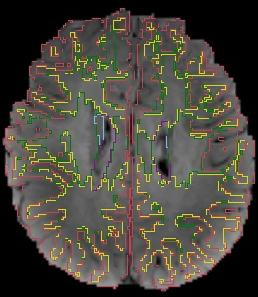

Dice coefficient: 0.913313858189733

## 8mo_Template01

Ground-truth sagittal       |  Inferred sagittal
:-------------------------:|:-------------------------:
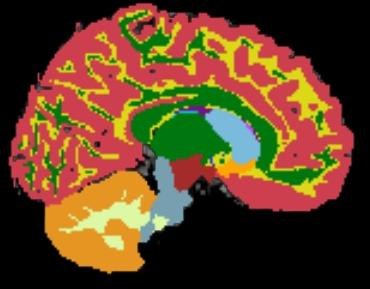  |  
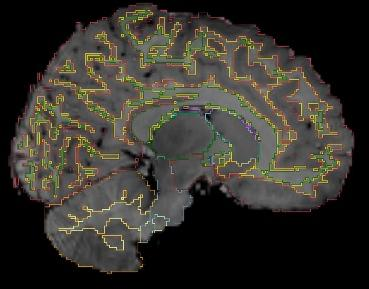  |  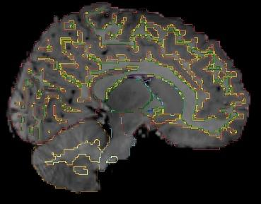

Ground-truth coronal       |  Inferred coronal
:-------------------------:|:-------------------------:
  |  
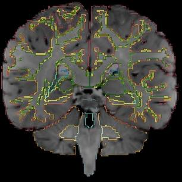  |  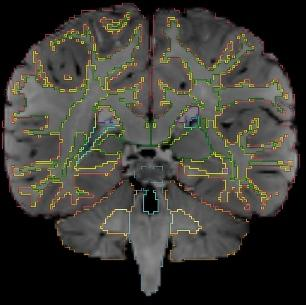

Ground-truth axial       |  Inferred axial
:-------------------------:|:-------------------------:
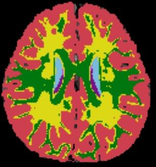 |  
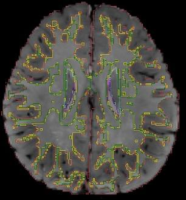  |  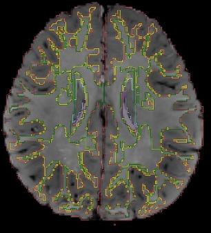

Dice coefficient: 0.8987183567711018

## Other test cases

| Test case      | Dice coefficient | 
| ----------- | ----------- |
| 00-02mos_Template04      | 0.8989362179879133        |
| 00-02mos_Template17   | 0.9400775783859089        |
| 00-02mos_Template19 | 0.9315040524238632         |
| 8mo_Template07 | 0.8579367247861686         |
| 8mo_Template09 | 0.878052172240119         |
