# Task504_Babies_AllMonthsWithSkull

I trained this nnU-Net model on 14 training cases of 1- to 8-month-old babies.
The age distribution for the training set was:

| Age (months)      | training set count | 
| ----------- | ----------- |
| 1  | 1        |
| 2 | 2         |
| 6 | 3         |
| 8 | 8         |

The T1 and T2 files are here:

    * /home/feczk001/shared/data/nnUNet/JLF_templates_testing/wm_JLF_atlases/head_files/

The manually segmented (a.k.a. "ground truth") files are here:

    * /home/feczk001/shared/data/nnUNet/JLF_templates_testing/wm_JLF_atlases/

The nnU-Net inferred segmentations are available here:

    * /home/feczk001/shared/data/nnUNet/segmentations/Task504_AllAgesWithSkull/predictions/

## Images

Here we have the images layered (from top to bottom):

1. Segmentation (100% opacity)
2. T1 (50% opacity)
3. T2

I also added smoothing.

### 1 month: Template 02

Ground-truth sagittal       |  Predicted sagittal
:-------------------------:|:-------------------------:
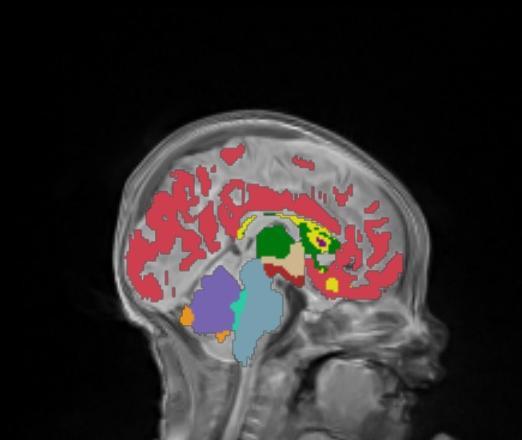  |  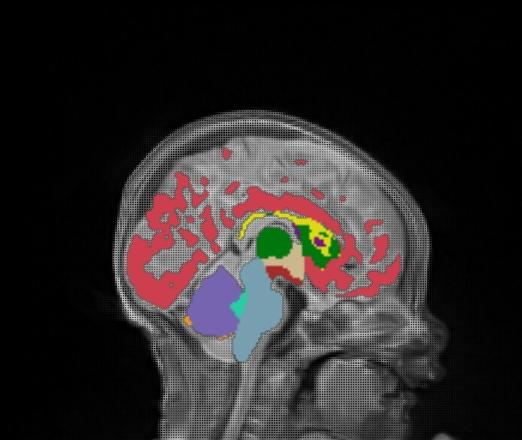
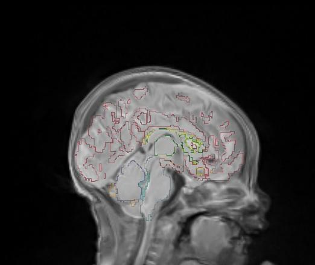  |  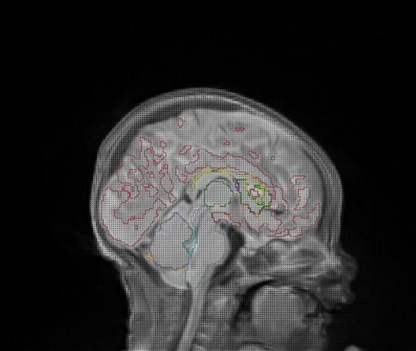

Ground-truth coronal       |  Predicted coronal
:-------------------------:|:-------------------------:
  |  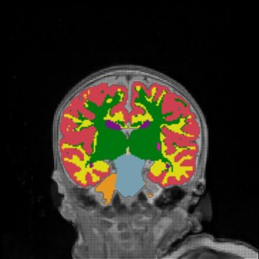
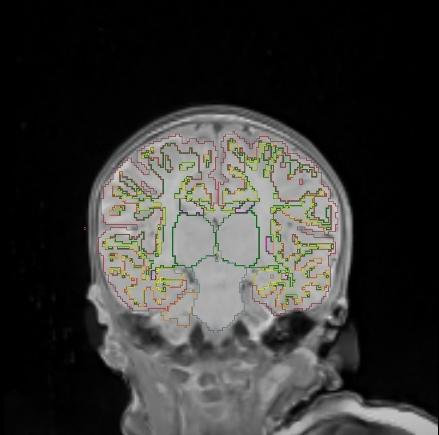  |  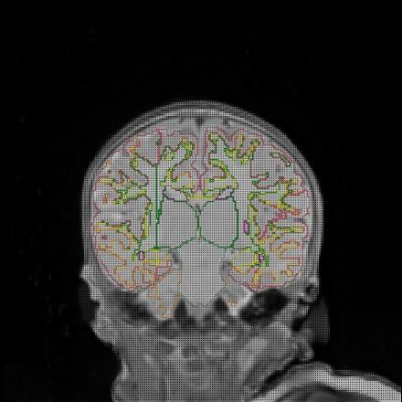

Ground-truth axial       |  Predicted axial
:-------------------------:|:-------------------------:
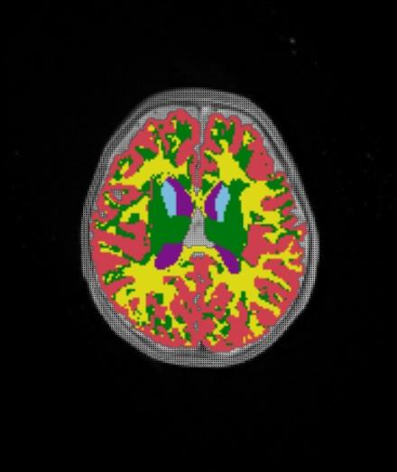  |  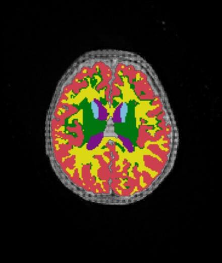
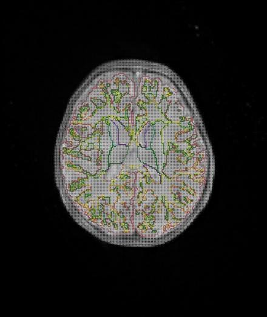  |  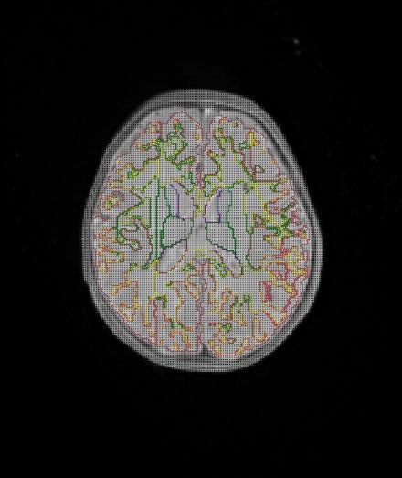

Dice coefficient: 0.24640555156759877

### 2 month: Template 03

Ground-truth sagittal       |  Predicted sagittal
:-------------------------:|:-------------------------:
  |  
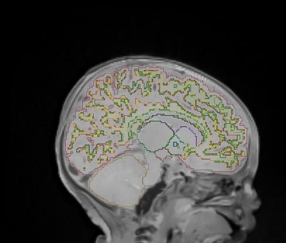  |  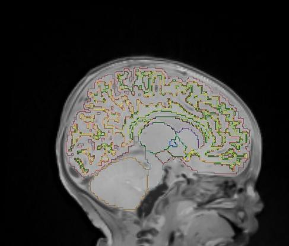

Ground-truth coronal       |  Predicted coronal
:-------------------------:|:-------------------------:
  |  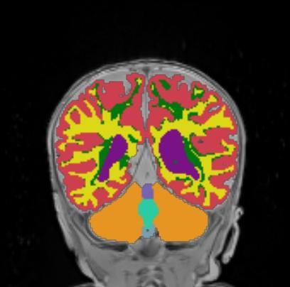
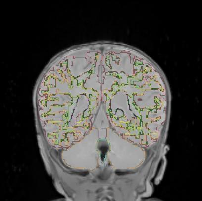  |  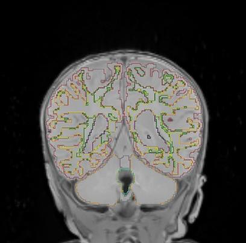

Ground-truth axial       |  Predicted axial
:-------------------------:|:-------------------------:
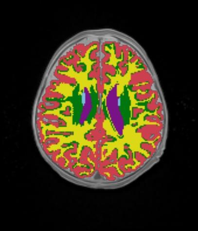  |  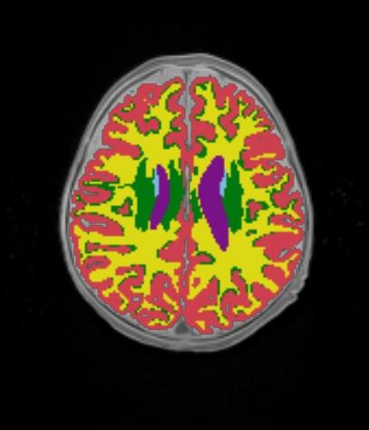
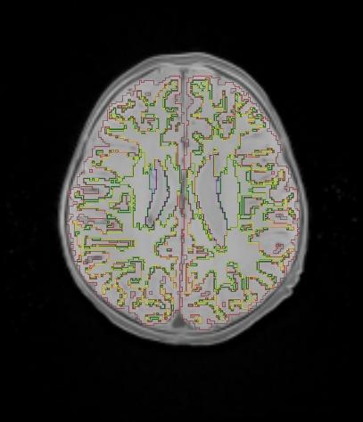  |  

Dice coefficient: 0.8730519327509725

### 6 month: Template 04

Ground-truth sagittal       |  Predicted sagittal
:-------------------------:|:-------------------------:
  |  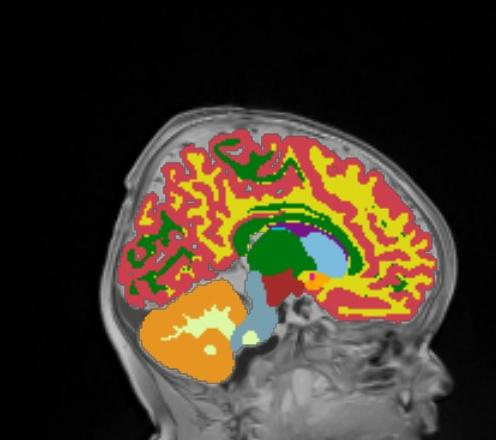
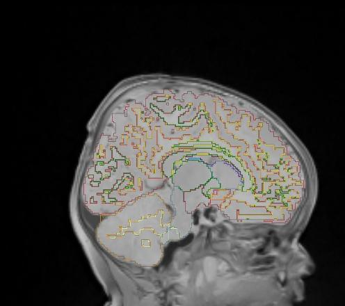  |  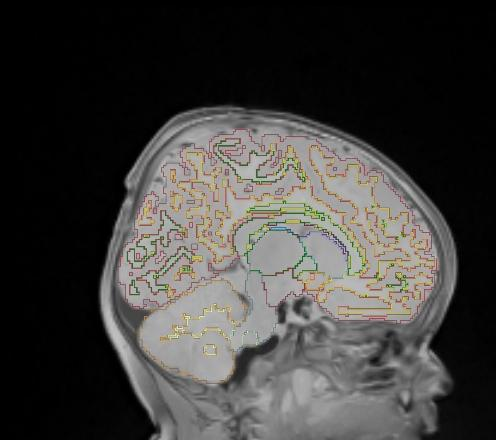

Ground-truth coronal       |  Predicted coronal
:-------------------------:|:-------------------------:
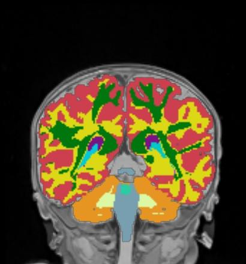  |  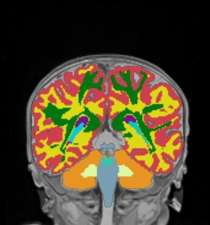
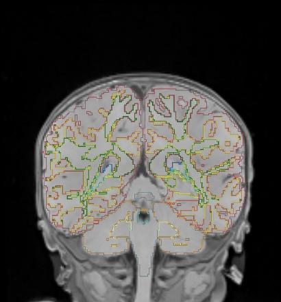  |  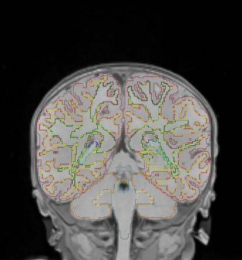

Ground-truth axial       |  Predicted axial
:-------------------------:|:-------------------------:
  |  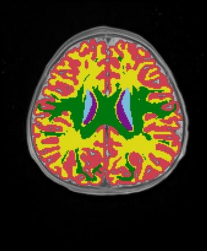
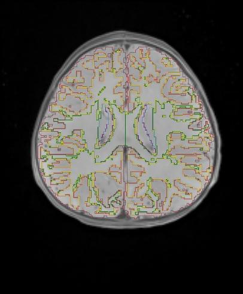  |  

Dice coefficient: 0.8922089516765477

### 8 month: Template 09

Ground-truth sagittal       |  Predicted sagittal
:-------------------------:|:-------------------------:
  |  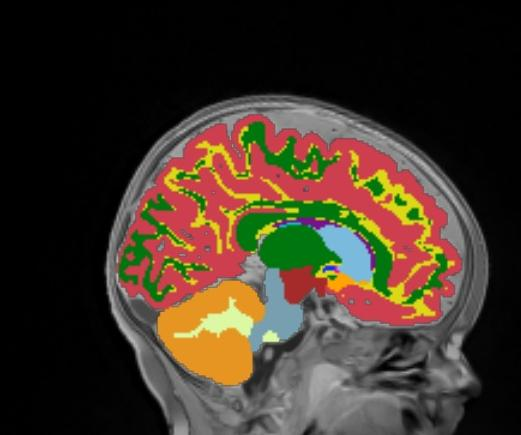
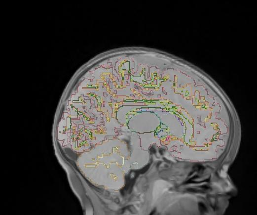  |  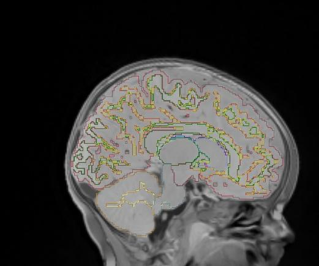

Ground-truth coronal       |  Predicted coronal
:-------------------------:|:-------------------------:
  |  
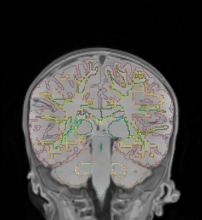  |  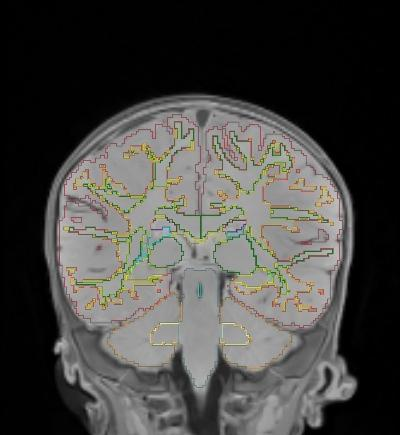

Ground-truth axial       |  Predicted axial
:-------------------------:|:-------------------------:
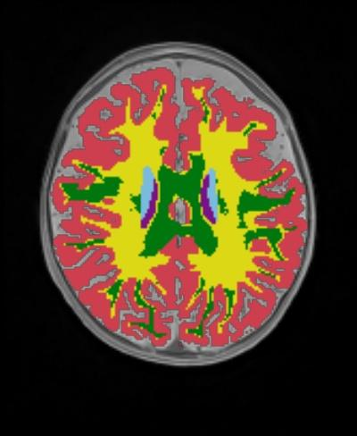  |  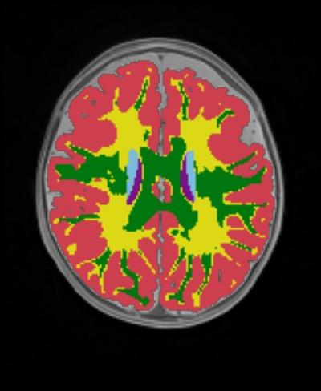
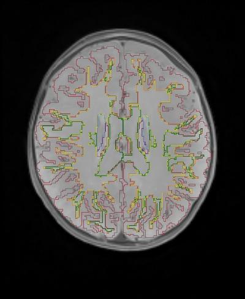  |  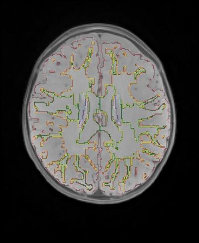

Dice coefficient: 0.8938236674895363
